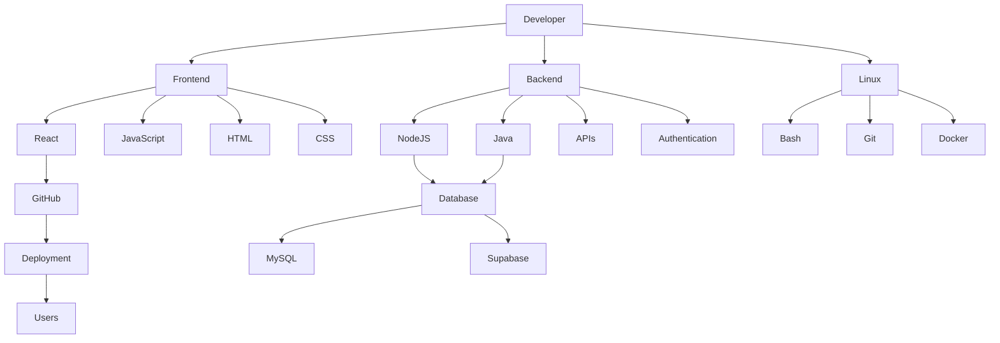
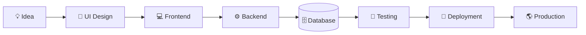
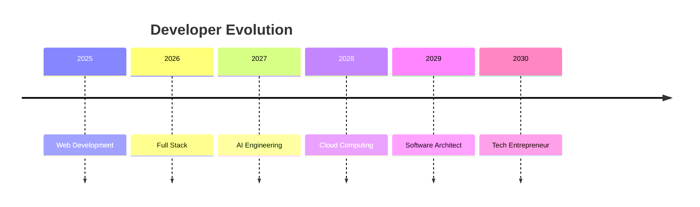

<div align="center">


</div>

<div align="center">

# ⚠ ACCESSING SECURE DEVELOPER TERMINAL

</div>

```text
████████████████████████████████████████████████████████████████

BOOT SEQUENCE STARTED...

Loading Kernel............................OK
Loading Developer Modules.................OK
Loading AI Core...........................OK
Loading Linux Environment.................OK
Loading Security Layer....................OK
Loading GitHub Interface..................OK
Loading Neural Interface..................OK

████████████████████████████████████████████████████████████████

SYSTEM NAME : EDUARDO_OS

VERSION     : 4.0

STATUS      : ONLINE

SECURITY    : MAXIMUM

ENCRYPTION  : AES-256

VISITOR     : AUTHORIZED

████████████████████████████████████████████████████████████████
```

---

<div align="center">


</div>

---

# SYSTEM STATUS

```diff
+ AI CORE.......................ONLINE
+ FIREWALL......................ACTIVE
+ DATABASE......................CONNECTED
+ TERMINAL......................READY
+ NETWORK.......................ENCRYPTED
+ GITHUB........................SYNCHRONIZED
+ SECURITY......................MAXIMUM
+ OS............................LINUX
```

---

# LIVE DASHBOARD

| MODULE | STATUS |
|---------|--------|
| 🟢 CPU | 23% |
| 🟢 RAM | 61% |
| 🟢 GPU | 41% |
| 🟢 AI Engine | ACTIVE |
| 🟢 Security | ENABLED |
| 🟢 Automation | RUNNING |
| 🟢 GitHub | CONNECTED |

---

# WHOAMI

```bash
root@eduardo-os:~# whoami

Name        : Eduardo Iraheta

Occupation  : Systems Engineering Student

Country     : El Salvador

Mode        : Full Stack Developer

Status      : Learning Every Day

Kernel      : Linux

Focus       : AI • Backend • Frontend • Databases

Mission     : Build software that actually matters.
```

---

# INITIALIZATION

```bash
root@eduardo-os:~$ boot

██████████████████████████████████

█████░░░░░░░░░░░░░░░░░ 15%

██████████░░░░░░░░░░░ 35%

████████████████░░░░░ 60%

████████████████████░ 90%

██████████████████████ 100%

Developer Environment Loaded Successfully.
```

---

<div align="center">

## SYSTEM OVERVIEW

</div>

```text
                     INTERNET
                         │
            ┌────────────┴─────────────┐
            │                          │
        FIREWALL                  AI CORE
            │                          │
       ┌────┴────┐                ┌────┴─────┐
       │         │                │          │
 TERMINAL     DATABASE        AUTOMATION   CLOUD
       │         │                │          │
       └─────────┴────────────────┴──────────┘
                   EDUARDO_OS
```

---

<div align="center">


</div>

---

```bash
root@eduardo-os:~$ status

Developer Core ............. ONLINE

AI Core .................... ONLINE

Terminal ................... ACTIVE

Automation ................. READY

GitHub ..................... CONNECTED

Mission .................... BUILD THE FUTURE
```

---

# NEXT SECTION

```text
>>>>>>>>>>>>>>>>>>>>>>>>>>>>>>>>>>>>>>>>>>

LOADING PERSONNEL DATABASE...

>>>>>>>>>>>>>>>>>>>>>>>>>>>>>>>>>>>>>>>>>>
```
# ╔══════════════════════════════════════════════════════════════╗
# ║                    PERSONNEL DATABASE                       ║
# ╚══════════════════════════════════════════════════════════════╝

<div align="center">


</div>

```text
█████████████████████████████████████████████████████

PERSONNEL RECORD FOUND

ID............... EDU-001
CLEARANCE........ LEVEL 5
STATUS........... ONLINE
LOCATION......... EL SALVADOR
KERNEL........... LINUX
ROLE............. FULL STACK DEVELOPER
CLASS............ SYSTEMS ENGINEERING STUDENT

█████████████████████████████████████████████████████
```

---

# 👤 PROFILE IDENTIFICATION

```yaml
NAME:
  Eduardo Iraheta

USERNAME:
  Eduarcito

ROLE:
  Systems Engineering Student

CURRENT OBJECTIVE:
  Become a Senior Full Stack Engineer

SPECIALIZATION:
  • React
  • JavaScript
  • Node.js
  • Java
  • Databases
  • Linux
  • AI Automation

STATUS:
  Constantly Learning
```

---

# NEURAL PROFILE

```bash
root@eduardo-os:~$ scan developer

Scanning brain...

██████████████████████████████ 100%

Result:

Creativity....................HIGH
Problem Solving...............HIGH
Curiosity.....................MAXIMUM
Coffee Dependency.............MEDIUM
Learning Speed................VERY HIGH
Debug Mode....................ALWAYS ENABLED
```

---

# EXPERIENCE LEVEL

```
Frontend

█████████████████████░░░░░░░░░░░░░░░░░░░░ 55%

Backend

█████████████████░░░░░░░░░░░░░░░░░░░░░░░░ 45%

Linux

███████████████████████████░░░░░░░░░░░░░ 70%

Automation

████████████████████████░░░░░░░░░░░░░░░░ 65%

Databases

████████████████████░░░░░░░░░░░░░░░░░░░░ 60%

Artificial Intelligence

██████████████████████░░░░░░░░░░░░░░░░░░ 63%
```

---

# PERSONALITY MATRIX

| ATTRIBUTE | LEVEL |
|-----------|-------|
| 💻 Coding | ████████████ 90% |
| 🧠 Learning | ██████████████ 100% |
| 🛠 Debugging | ███████████ 88% |
| 🚀 Building Projects | █████████████ 95% |
| ☕ Coffee | ███████ 65% |
| 🎯 Consistency | ███████████ 92% |

---

# ACTIVE PROTOCOLS

```diff
+ Linux Workflow.................ENABLED
+ AI Assisted Coding.............ONLINE
+ REST APIs......................ACTIVE
+ Git Version Control............CONNECTED
+ Responsive Design..............READY
+ SQL Database Layer.............RUNNING
+ Backend Services...............ONLINE
+ Terminal Productivity..........MAXIMUM
```

---

# DEVELOPER DNA

```javascript
const Eduardo = {

    alias: "Eduarcito",

    status: "ONLINE",

    location: "El Salvador",

    education: "Systems Engineering",

    currentlyLearning: [
        "React",
        "Node.js",
        "Java",
        "Linux",
        "Supabase",
        "AI Automation"
    ],

    hobbies: [
        "Coding",
        "Cybersecurity",
        "Linux",
        "Gaming",
        "Technology"
    ],

    lifeGoal:
        "Build software that changes people's lives.",

    motto:
        "Never stop learning."
}
```

---

# DAILY ROUTINE

```text
08:00 █████████░░ Wake Up

09:00 █████████████ Coding

12:00 ██████░░░ Lunch

13:00 ████████████ Study

16:00 █████████████ Build Projects

20:00 ██████████ Learn Something New

23:00 ███████ Sleep
```

---

# CURRENT OBJECTIVES

```text
[✔] Learn React Fundamentals

[✔] Improve JavaScript

[✔] Build Real Projects

[✔] Learn REST APIs

[✔] Master Git

[✔] Improve SQL

[ ] Learn Docker

[ ] Kubernetes

[ ] Cloud Computing

[ ] Cyber Security

[ ] Artificial Intelligence Engineer
```

---

# MISSION STATUS

```text
MISSION..............BECOME ELITE DEVELOPER

Progress

██████████████████████░░░░░░░░░░ 63%

ETA

████████░░░░░░

Still Learning...
```

---

# DEVELOPER TERMINAL

```bash
root@eduardo-os:~$ whoami

Eduardo Iraheta

root@eduardo-os:~$ current_mission

Building amazing software...

root@eduardo-os:~$ future

Senior Full Stack Engineer

root@eduardo-os:~$ exit

Session remains active...
```

---

<div align="center">

# NEXT MODULE LOADING...

```
██████████████████████████████████████

LOADING AI CORE...

LOADING SECURITY MODULE...

LOADING TECH INVENTORY...

██████████████████████████████████████
```

</div>
# ╔════════════════════════════════════════════════════════════════════╗
# ║                        AI CORE v4.2                              ║
# ╚════════════════════════════════════════════════════════════════════╝

<div align="center">


</div>

```text
██████████████████████████████████████████████████████

INITIALIZING ARTIFICIAL INTELLIGENCE...

Neural Network.................ONLINE

Machine Learning...............ONLINE

Code Assistant.................READY

Automation Engine..............CONNECTED

Reasoning Module...............ACTIVE

██████████████████████████████████████████████████████
```

---

# AI STATUS

```diff
+ GPT Integration................ONLINE

+ Code Analysis.................ACTIVE

+ Automation....................RUNNING

+ Debug Assistant...............READY

+ Documentation................SYNCED

+ Learning Mode................EVOLVING
```

---

# POWER CORE

```
Energy

███████████████████████████████████ 100%

AI Performance

██████████████████████████████░░░░ 92%

Developer Mode

██████████████████████████████████ 100%

Focus Level

██████████████████████████░░░░░░░░ 84%

Creativity

█████████████████████████████░░░░░ 89%
```

---

# CORE MODULES

| MODULE | STATUS |
|--------|--------|
| 🟢 Frontend Engine | ONLINE |
| 🟢 Backend Engine | ONLINE |
| 🟢 Linux Kernel | ONLINE |
| 🟢 Git Engine | CONNECTED |
| 🟢 SQL Database | READY |
| 🟢 AI Core | ACTIVE |
| 🟢 Automation | RUNNING |
| 🟢 API Gateway | ONLINE |
| 🟢 Authentication | READY |
| 🟢 Cloud Sync | CONNECTED |

---

# MODULE INVENTORY

```text
╔══════════════════════════════════════════════╗
║              MODULE INVENTORY                ║
╠══════════════════════════════════════════════╣
║ HTML Engine                 ✔ ONLINE         ║
║ CSS Renderer                ✔ ONLINE         ║
║ JavaScript Runtime          ✔ ONLINE         ║
║ React Framework             ✔ ONLINE         ║
║ NodeJS Runtime              ✔ ONLINE         ║
║ Java Compiler               ✔ ONLINE         ║
║ MySQL Database              ✔ ONLINE         ║
║ Git Version Control         ✔ ONLINE         ║
║ Linux Terminal              ✔ ONLINE         ║
║ AI Assistant                ✔ ONLINE         ║
╚══════════════════════════════════════════════╝
```

---

# TECHNOLOGY REACTOR

<div align="center">


</div>

---

# CYBER MODULES

<div align="center">


</div>

---

# SYSTEM ARCHITECTURE



---

# SECURITY LAYER

```text
╔════════════════════════════════════╗

FIREWALL...............ENABLED

ENCRYPTION.............AES-256

ACCESS CONTROL.........ACTIVE

DDOS PROTECTION........ONLINE

API SHIELD.............ACTIVE

ROOT ACCESS............AUTHORIZED

╚════════════════════════════════════╝
```

---

# LIVE TELEMETRY

```bash
Developer Temperature

██████████████░░░░░░░░░░░ 61%

Coffee Level

██████████████████░░░░░░░ 78%

Bug Detection

█████████████████████░░░░ 91%

Sleep

███████░░░░░░░░░░░░░░░░░░ 35%

Motivation

█████████████████████████ 100%
```

---

# NETWORK CONNECTIONS

```text
Internet...............CONNECTED

GitHub.................CONNECTED

OpenAI.................CONNECTED

Linux.................CONNECTED

VS Code...............CONNECTED

Supabase..............CONNECTED

MySQL.................CONNECTED

Cloud.................CONNECTED
```

---

# AI COMMAND CENTER

```bash
root@eduardo-os:~$ ai status

AI Core....................ONLINE

Reasoning..................ACTIVE

Learning...................RUNNING

Optimization...............ENABLED

root@eduardo-os:~$ developer --scan

Result:

Frontend...............READY

Backend................READY

Linux..................READY

Automation.............READY

Mission................BUILD THE FUTURE
```

---

<div align="center">

# LOADING NEXT MODULE...

```text
█████████████████████████████████████

Loading Mission Control...

Loading GitHub Analytics...

Loading Project Archives...

█████████████████████████████████████
```

</div>
# ╔══════════════════════════════════════════════════════════════╗
# ║                    MISSION CONTROL                          ║
# ╚══════════════════════════════════════════════════════════════╝

<div align="center">


</div>

---

# TECHNOLOGY MATRIX

```text
╔════════════════════════════════════════════════════════════════════╗
║                    TECHNOLOGY MATRIX                             ║
╠════════════════════════════════════════════════════════════════════╣
║ HTML              ████████████████████ 100%                      ║
║ CSS               ██████████████████░░ 95%                       ║
║ JavaScript        █████████████████░░░ 90%                       ║
║ React             ██████████████░░░░░░ 82%                       ║
║ Node.js           █████████████░░░░░░░ 80%                       ║
║ Java              ██████████████░░░░░░ 83%                       ║
║ MySQL             █████████████░░░░░░░ 81%                       ║
║ Linux             ███████████████████░ 96%                       ║
║ Git               ██████████████████░░ 94%                       ║
║ AI Automation     ███████████████░░░░░ 87%                       ║
╚════════════════════════════════════════════════════════════════════╝
```

---

# PRIMARY SYSTEMS

<div align="center">

| SYSTEM | STATE |
|---------|-------|
| 🌐 Frontend | 🟢 ONLINE |
| ⚙ Backend | 🟢 ONLINE |
| 💾 Database | 🟢 ONLINE |
| 🐧 Linux Core | 🟢 ACTIVE |
| 🤖 AI Engine | 🟢 ACTIVE |
| 🔒 Security | 🟢 ENABLED |
| ☁ Cloud | 🟢 CONNECTED |
| 🚀 Deployment | 🟢 READY |

</div>

---

# DEVELOPER SPECIALIZATIONS

```yaml
Frontend:
  - HTML
  - CSS
  - JavaScript
  - React
  - Bootstrap
  - TailwindCSS

Backend:
  - Node.js
  - Java
  - REST APIs
  - Authentication

Database:
  - MySQL
  - Supabase

Operating System:
  - Linux
  - Bash
  - Git

Artificial Intelligence:
  - OpenAI
  - Prompt Engineering
  - Automation
  - n8n
```

---

# DEVELOPMENT PIPELINE



---

# PROJECT LIFECYCLE

```text
IDEA

██████████████████████████

↓

PLANNING

██████████████████████████

↓

DESIGN

██████████████████████████

↓

CODING

██████████████████████████

↓

DEBUGGING

██████████████████████████

↓

DEPLOY

██████████████████████████
```

---

# CURRENT MISSION

```bash
root@eduardo-os:~$ mission

Mission ID..............FS-001

Objective...............Become Elite Full Stack Engineer

Priority................MAXIMUM

Difficulty..............HARD

Status..................RUNNING

ETA.....................UNKNOWN
```

---

# AI AUTOMATION LAB

| MODULE | STATUS |
|---------|--------|
| 🤖 OpenAI | ACTIVE |
| 🔥 n8n | ACTIVE |
| 🌐 APIs | ONLINE |
| 🧠 Prompt Engineering | ACTIVE |
| ⚡ Workflow Automation | ONLINE |
| 📊 Data Processing | ONLINE |
| ☁ Cloud Integration | READY |

---

# CURRENT LEARNING PATH

```text
Linux

██████████████████████████████

↓

Git

██████████████████████████████

↓

JavaScript

██████████████████████████████

↓

React

██████████████████████████░░░░

↓

Node.js

███████████████████████░░░░░░░

↓

System Design

███████████████░░░░░░░░░░░░░░░

↓

Cloud

█████████░░░░░░░░░░░░░░░░░░░░░
```

---

# DEVELOPER RADAR

```text
                 AI
                ▲
                │
 Linux ◄────────┼────────► Frontend
                │
                ▼
             Backend

         Database ● APIs
```

---

# ACTIVE OBJECTIVES

```diff
+ Master React Ecosystem

+ Build Scalable APIs

+ Learn Docker

+ Learn Kubernetes

+ Learn AWS

+ Master Linux

+ Build AI Applications

+ Create Real Products

+ Contribute to Open Source

+ Become Senior Engineer
```

---

# SYSTEM MONITOR

```bash
CPU......................34%

Memory...................58%

GitHub Activity..........ONLINE

Repositories.............SYNCED

Developer Mode...........ENABLED

Bug Hunter...............ACTIVE

AI Assistant.............CONNECTED
```

---

# FUTURE ROADMAP



---

<div align="center">

## NEXT SYSTEM LOADING

```text
██████████████████████████████████████████

Synchronizing GitHub Analytics...

Loading Contribution Graph...

Preparing Repository Scanner...

██████████████████████████████████████████
```

</div>
